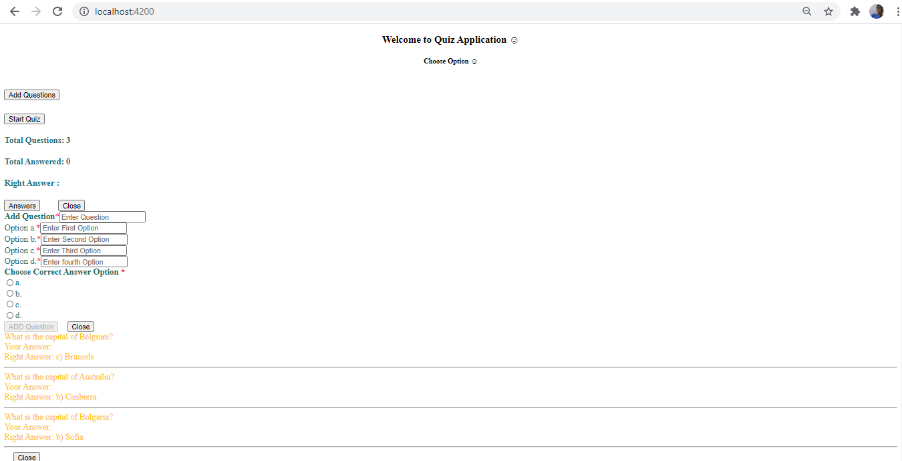
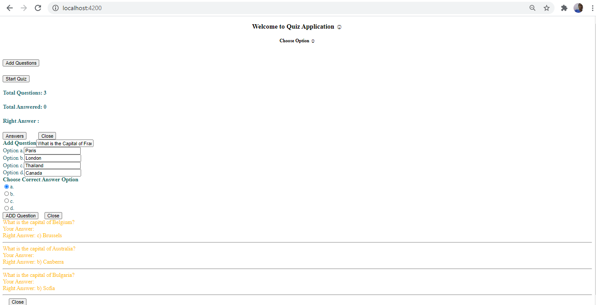
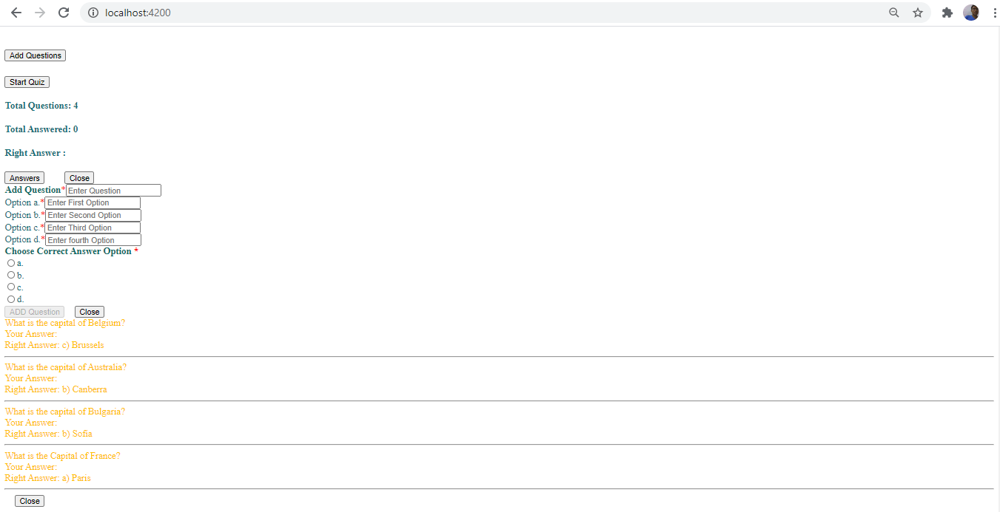
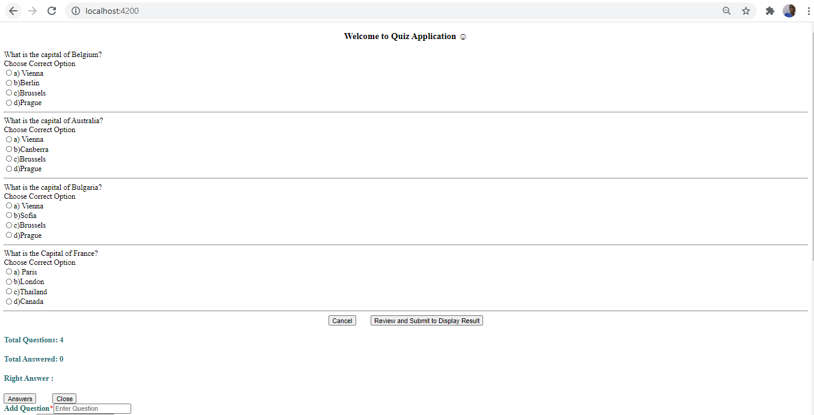
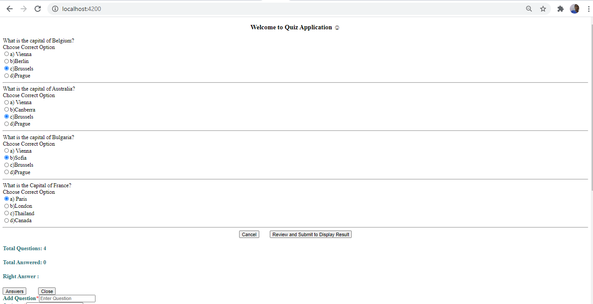
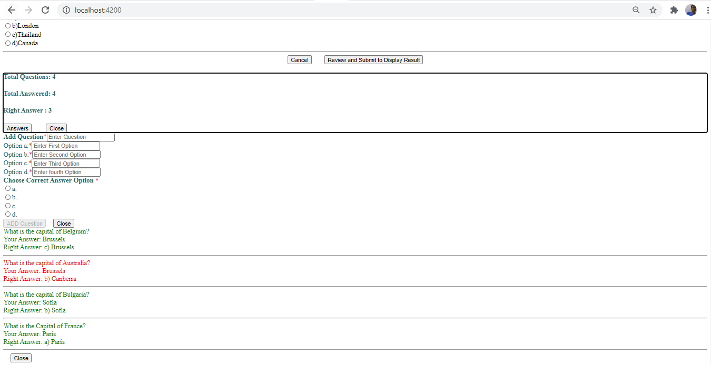

# Online-Quiz-Application
Please refer to https://github.com/devadeepdeb/Online-Quiz-Application/blob/master/online-quiz-application/README.md

## Technologies Used

| Angular CLI | 11.1.2 |
| ------ | ------- |
| NodeJS | 14.15.4 |
| Node Package Manager  | 6.14.10 |
| Visual Studio Code | 1.52.1 |

## App Details
This App contains three main modules: Quiz, Review, and Result. The quiz section of the online test application accepts the questions in JSON format. The application renders the test at the client-side.
The “Review and display result” section allows users to declare the results immediately as per the below screenshots:
1) Homepage Screen

2) Type New Question

3) Click on "ADD Question" Button

4) Click on "Start Quiz" Button

5) Choose correct answers and click on "Review and Submit to Display Result" buttons

6) See the results. Yellow color indicates unattended questions, Green color indicates correct answers, Red color indicates incorrect answers.

